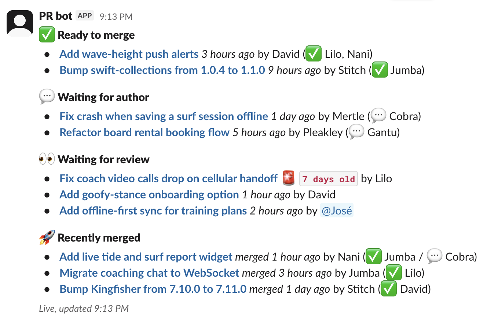

[](https://github.com/hellej/pr-slack-reminder-action/actions/workflows/ci.yml) [](https://github.com/hellej/pr-slack-reminder-action/actions/workflows/build.yml) [](https://coveralls.io/github/hellej/pr-slack-reminder-action?branch=main)

# PR Slack Reminder Action

This GitHub Action sends a friendly Slack reminder about open Pull Requests. The Slack message contains a list of PRs with (optional) highlighting for the old ones and can be set to auto-update as PRs get reviewed or merged.

### Example Output



## GitHub's Built-in vs This Action

You may not need this action; GitHub provides [built-in scheduled reminders for teams](https://docs.github.com/en/organizations/organizing-members-into-teams/managing-scheduled-reminders-for-your-team) which works well in many situations.

**When to use GitHub's built-in reminders:**

- Your team structure aligns well with GitHub teams
- The CODEOWNERS files of your repositories accurately match your team structure (-> reviews are automatically requested from the right people)
- You're okay with the 5 repository limit per reminder
- You don't need custom message content or formatting
- You don't need different filtering options for each repository
- You prefer a GUI (github.com) for setting up the reminders (as opposed to YAML)

**What's special about this action:**

- Monitor up to 30 repositories
- Option to ["refresh" the latest PR reminder](#3-advanced-setup-with-update-mode-enabled) when PRs get reviewed or merged (with run-mode: `update`)
- Snooze individual PRs with a [`/snooze` comment](#-tips)
- Highlight old PRs that need attention (with optional age threshold input)
- Concise review status info for each PR with emojis (incl. approvers & commenters)
- More customizable message content
- Global and repository specific filters
- Anyone can set this up (no need to be a GitHub team maintainer)
- No need for official GitHub team setup
- No need for perfect CODEOWNERS files to get reminded about the right PRs

## Getting Started

### Prerequisites

- [Slack bot token](#-slack-bot-token-scopes) with permissions to post messages
- [GitHub token](#-github-token-setup) with read access to your repositories

### Basic Usage Examples

#### 1. Simple Setup (Single Repository)

This monitors open PRs in your current repository.

```yaml
name: PR Reminder

on:
  schedule:
    - cron: "0 9 * * MON-FRI" # 9 AM on weekdays

jobs:
  remind:
    runs-on: ubuntu-latest
    steps:
      - uses: hellej/pr-slack-reminder-action@v1
        with:
          github-token: ${{ secrets.GITHUB_TOKEN }}
          slack-bot-token: ${{ secrets.SLACK_BOT_TOKEN }}
          slack-channel-name: "dev-team"
```

#### 2. Multiple Repositories & Filters

Monitor several repositories with user mentions, filters and custom messaging.

```yaml
name: PR Reminder

on:
  schedule:
    - cron: "0 9 * * MON-FRI" # 9 AM on weekdays

jobs:
  remind:
    runs-on: ubuntu-latest
    steps:
      - uses: hellej/pr-slack-reminder-action@v1
        with:
          github-token: ${{ secrets.GITHUB_TOKEN }}
          slack-bot-token: ${{ secrets.SLACK_BOT_TOKEN }}
          slack-channel-name: "code-reviews"
          github-repositories: |
            myorg/frontend
            myorg/backend
            myorg/mobile-app
          github-user-slack-user-id-mapping: |
            alice: U1234567890
            kronk: U2345678901
            charlie: U3456789012
          pr-list-heading: "We have <pr_count> PRs waiting for review! 👀"
          no-prs-message: "🎉 All caught up! No PRs waiting for review."
          old-pr-threshold-hours: 48
          filters: |
            {
              "ignored-labels": ["draft", "wip"],
              "ignored-authors": ["dependabot[bot]"]
            }
          repository-filters: |
            backend: {"labels": ["ready-for-review"], "ignored-authors": ["intern-bot"]}
            mobile-app: {}
```

(^ PRs from `mobile-app` repo won't be filtered by the global filters)

#### 3. Advanced Setup with Update Mode Enabled

Setup where the latest message is also updated when PRs get reviewed/merged.
PRs that were merged since the original message are shown with 🚀 emoji suffix.
However, the updated message will not contain new PRs published since the original message.

Example:


```yaml
name: PR Reminder

on:
  schedule:
    - cron: "0 9 * * MON-FRI" # 9 AM on weekdays
  push:
    branches: [main]
  pull_request:
    types: [closed, ready_for_review]
  pull_request_review:
    types: [submitted]
  issue_comment:

concurrency:
  group: ${{ github.workflow }}-${{ github.event_name == 'schedule' && 'scheduled' || 'other' }}
  cancel-in-progress: false

jobs:
  send-or-update-pr-reminder:
    runs-on: ubuntu-latest
    permissions:
      pull-requests: read
      issues: read
      actions: read
    steps:
      - uses: hellej/pr-slack-reminder-action@v1
        with:
          github-token: ${{ secrets.GITHUB_TOKEN }}
          slack-bot-token: ${{ secrets.SLACK_BOT_TOKEN }}
          slack-channel-name: "dev-team"
          run-mode: ${{ github.event_name == 'schedule' && 'post' || 'update' }}

      - uses: actions/upload-artifact@v7
        with:
          name: pr-slack-reminder-state
          path: pr-slack-reminder-state.json
          retention-days: 1
```

## ➡️ Inputs

| Name                                | Required | Description                                                                                                                                                                                |
| ----------------------------------- | -------- | ------------------------------------------------------------------------------------------------------------------------------------------------------------------------------------------ |
| `slack-bot-token`                   | ✅       | Slack bot token for sending messages<br>Example: `${{ secrets.SLACK_BOT_TOKEN }}`                                                                                                          |
| `github-token`                      | ✅       | GitHub token for repository access<br>Example: `${{ secrets.GITHUB_TOKEN }}`                                                                                                               |
| `github-token-for-state`            | ❌       | GitHub token that has read access to artifacts of the current repository (i.e. actions: read). Only needed if the run-mode is `update` and if the default github-token misses permissions. |
| `run-mode`                          | ❌       | Run mode: `post` (default) posts a new reminder; `update` refreshes an existing reminder                                                                                                   |
| `state-artifact-name`               | ❌       | Name of the artifact containing state from previous run (used when `run-mode` is `update`)<br>Default: `pr-slack-reminder-state`                                                           |
| `slack-channel-name`                | ❌       | Slack channel name (use this OR `slack-channel-id`)                                                                                                                                        |
| `slack-channel-id`                  | ❌       | Slack channel ID (use this OR `slack-channel-name`)<br>Example: `C1234567890`                                                                                                              |
| `github-repositories`               | ❌       | Repositories to monitor (max 30) - defaults to current repo<br>Example:<br>`owner/repo1`<br>`owner/repo2`                                                                                  |
| `filters`                           | ❌       | Global filters (JSON)<br>Example:<br>`{"authors": ["alice"], "ignored-labels": ["wip"]}`                                                                                                   |
| `repository-filters`                | ❌       | Repository-specific filters<br>Example:<br>`repo1: {"labels": ["bug"]}`<br>`repo2: {"ignored-authors": ["bot"]}`                                                                           |
| `github-user-slack-user-id-mapping` | ❌       | Map of GitHub usernames to Slack user IDs<br>Example:<br>`alice: U1234567890`<br>`kronk: U2345678901`                                                                                      |
| `pr-list-heading`                   | ❌       | Message heading (`<pr_count>` gets replaced)<br>Default: `There are <pr_count> open PRs 👀`                                                                                                |
| `no-prs-message`                    | ❌       | Message when no PRs are found (if not set, no empty message gets sent)<br>Example: `All caught up! 🎉`                                                                                     |
| `old-pr-threshold-hours`            | ❌       | PR age in hours after which a PR is highlighted as old with alarm emoji and bold age text (defaults to `96`)                                                                               |
| `group-by-repository`               | ❌       | Group PRs by repository with repository headings (defaults to `false`). When enabled, `pr-list-heading` is ignored.                                                                        |
| `pr-tracker-canvas-link`            | ❌       | Link to a Slack canvas to keep updated with a live tracker of open, work-in-progress and recently merged PRs (see [PR Tracker Canvas](#-pr-tracker-canvas)). Leave empty to disable (default).              |

### Filter Options

Both `filters` and `repository-filters` support:

- `authors` - Only include PRs by these users
- `ignored-authors` - Exclude PRs by these users
- `labels` - Only include PRs with these labels
- `ignored-labels` - Exclude PRs with these (overrides the above)
- `ignored-terms` - Exclude PRs whose title contains any of these terms

⚠️ **Note**: You cannot use both `authors` and `ignored-authors` in the same filter.

## 📋 PR Tracker Canvas

Optional: keep a Slack canvas updated with a live view of the PRs across all monitored repositories. The reminder message is transient and never lists drafts; the canvas is persistent, readable on demand, and has sections for work-in-progress and recently merged PRs too.

Every `post` run rewrites the canvas. An `update` run rewrites it only when its content changed.

```markdown
## Open

- **[Add pagination to the PR listing](https://github.com/test-org/test-repo/pull/1)** _5 hours ago_ by Alice Anderson (✅ Dana Davis / 💬 Erin Evans)
- **[Bump the Slack SDK](https://github.com/test-org/repo-two/pull/2)** _30 minutes ago_ by Bob Brown

## WIP

- **[Spike: replace mux with chi](https://github.com/test-org/test-repo/pull/3)** by Carol Clark `updated 5 hours ago`

## Merged

- **[Bump the Slack SDK](https://github.com/test-org/repo-two/pull/2)** _merged 5 hours ago_ by Bob Brown 🚀
- **[Drop the REST fallback](https://github.com/test-org/test-repo/pull/9)** _merged 3 days ago_ by Alice Anderson 🚀

---

_Updated 2026-08-08 06:15 UTC_
```

Open PRs are listed oldest first, WIP PRs by most recent activity, merged PRs by most recent merge. Drafts with no activity for 60 days are left out, and at most 5 drafts idle for over 24 hours are shown. The merged section lists at most 10 PRs merged within the last 7 days, and names no reviewers.

### Setup

1. Add a canvas tab to the channel that gets the reminders.
2. Give the canvas a title, the action never sets one.
3. Open that canvas → ⋮ → **Copy link**.
4. Paste the link into `pr-tracker-canvas-link`:

```yaml
pr-tracker-canvas-link: https://myworkspace.slack.com/docs/T01234ABCDE/F01234ABCDE
```

Also grant the bot token the `canvases:write` scope. The bot still needs
to be in the same channel as the canvas to have write access.

### Good to know

- ⚠️ The action owns the whole canvas. A write replaces all of its content, so anything typed there by hand survives only until the next write.
- The canvas notifies nobody. Authors and reviewers are shown as plain GitHub names, never as Slack mentions, because every run would otherwise re-notify all of them.
- These inputs shape the canvas too: `github-repositories`, `filters`, `repository-filters`, `old-pr-threshold-hours`, `group-by-repository` and `/snooze` comments. `pr-list-heading`, `no-prs-message` and `github-user-slack-user-id-mapping` don't apply, the canvas has fixed headings and no mentions.
- A failing canvas update fails the run, but never stops the reminder message from being sent or updated.
- The `_Updated <ts>_` footer says when the canvas was last written, not when the action last ran.
- A canvas that shows duplicated headings or PR rows is a rendering artifact in the Slack client, not lost data. Reload the canvas to see its real content.

## 💡 Tips

- **Highlight old PRs**: Set a reasonable `old-pr-threshold-hours` to highlight stale PRs (consider weekends too)
- **Snooze a PR**: Comment `/snooze for 3 days` (or `/snooze PR reminder for 3 days`) on a PR to temporarily hide it from reminders. To unsnooze, delete the comment or post `/snooze for 0 days`.
- **Use cron scheduling**: Run reminders at times that work for your team (avoid weekends!)
- **Customize messages**: Make the reminders fit your team's culture

## 💬 Slack Bot Token Scopes

The bot token needs the scopes below. The bot must also be a member of the target channel to post to it.

| Scope            | Required                                                  | Used for                                             |
| ----------------- | ----------------------------------------------------------- | ------------------------------------------------------ |
| `chat:write`       | ✅ Always                                                     | Sending, updating and deleting the reminder message     |
| `channels:read`   | Only with `slack-channel-name` for a **public** channel     | Looking up the channel ID by name                       |
| `groups:read`     | Only with `slack-channel-name` for a **private** channel    | Looking up the channel ID by name                        |
| `canvases:write`  | Only with `pr-tracker-canvas-link`                          | Replacing the content of the [PR tracker canvas](#-pr-tracker-canvas) |

💡 You can skip `channels:read`/`groups:read` entirely by using `slack-channel-id` instead of `slack-channel-name` - then only `chat:write` is needed.

## 🔑 GitHub Token Setup

### Required Permissions

PR data is read through GitHub's GraphQL API.

If you're using the default `GITHUB_TOKEN`, grant these via the job's `permissions:` block (same permission names apply to GitHub App installations):

```yaml
permissions:
  pull-requests: read # listing/fetching PRs and reviews
  issues: read # reading PR comments (incl. /snooze comments)
  actions: read # only needed for run-mode: update - downloading the previous run's state artifact
```

### Option 1: Default Token (Single Repository)

For monitoring just your current repository, the default `GITHUB_TOKEN` (available automatically) works perfectly:

```yaml
github-token: ${{ secrets.GITHUB_TOKEN }}
```

### Option 2: GitHub App (Recommended for Multi-Repository Setups)

For better security and granular permissions, especially when monitoring multiple repositories, using a GitHub App is the recommended approach.

1.  **Create a GitHub App** in your organization or personal account settings.
2.  **Give it necessary permissions** (e.g., "read" access to PRs).
3.  **Install the app** on the repositories you want to monitor. During installation, you can choose to grant access to **all repositories** (of your organization) or only to **specific ones**. For better security, it's recommended to select only the repositories you intend to monitor.
4.  **Add the App ID and Private Key** as secrets in the repository where your workflow runs.
5.  **Use a token generation action** (like `actions/create-github-app-token`) in your workflow to generate a temporary token.

Here is an example of how to implement it in your workflow:

```yaml
name: PR Reminder

on:
  schedule:
    - cron: "0 9 * * MON-FRI"

jobs:
  remind:
    runs-on: ubuntu-latest
    steps:
      - name: Generate GitHub App Token
        id: generate-token
        uses: actions/create-github-app-token@v3
        with:
          app-id: ${{ secrets.APP_ID }}
          private-key: ${{ secrets.APP_PRIVATE_KEY }}

      - name: Send PR Reminder
        uses: hellej/pr-slack-reminder-action@v1
        with:
          github-token: ${{ steps.generate-token.outputs.token }}
          slack-bot-token: ${{ secrets.SLACK_BOT_TOKEN }}
          slack-channel-name: "dev-team"
          github-repositories: |
            my-org/repo1
            my-org/repo2
```

### Option 3: Personal Access Token (Alternative)

To monitor multiple repositories, you may also use a Personal Access Token (PAT):

1. **Go to GitHub Settings** → Developer settings → Personal access tokens → Fine-grained tokens
2. **Click "Generate new token"** → Select the repositories of interest and at least read access to PRs
3. **Add the token as a repository secret** named `PR_REMINDER_GITHUB_TOKEN`
4. **Use it in your workflow:** `github-token: ${{ secrets.PR_REMINDER_GITHUB_TOKEN }}`

## 👋 Contributing

Found a bug? Feel free to open an issue!

## 📄 License

This project is licensed under the MIT License - see the [LICENSE](LICENSE) file for details.
